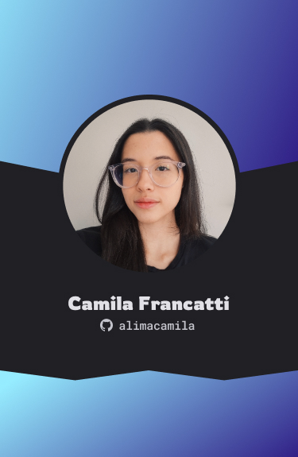

<h1 align="left">Oi , eu sou a Camila</h1>

- 👩‍💻 Estudante de Ciências da Computação

- 💻 Conhecimentos em **JavaScript, HTML e CSS**

- ⚡ Criativa, comunicativa e comprometida

- 🌎 **Português** (nativo) e **Inglês** (intermediário)
  

## 🛠 Tecnologias
&nbsp;
&nbsp;
&nbsp;
&nbsp;
&nbsp;
&nbsp;
  

## 📱 Contato

  
  
  

 

## ⚙ Estatísticas GitHub

  
  

<!--
**Alimacamila/Alimacamila** is a ✨ _special_ ✨ repository because its `README.md` (this file) appears on your GitHub profile.

Here are some ideas to get you started:

- 🔭 I’m currently working on ...
- 🌱 I’m currently learning ...
- 👯 I’m looking to collaborate on ...
- 🤔 I’m looking for help with ...
- 💬 Ask me about ...
- 📫 How to reach me: ...
- 😄 Pronouns: ...
- ⚡ Fun fact: ...
-->
